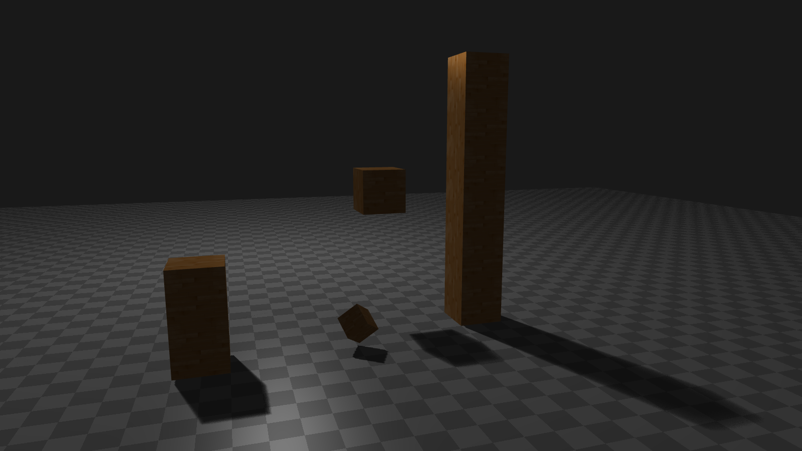
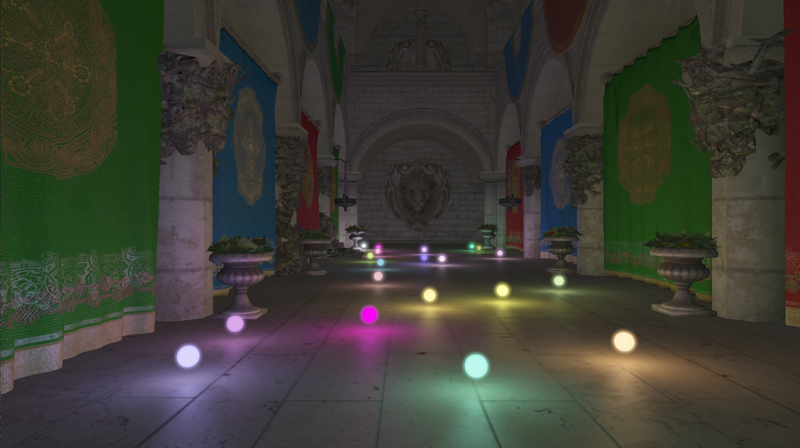
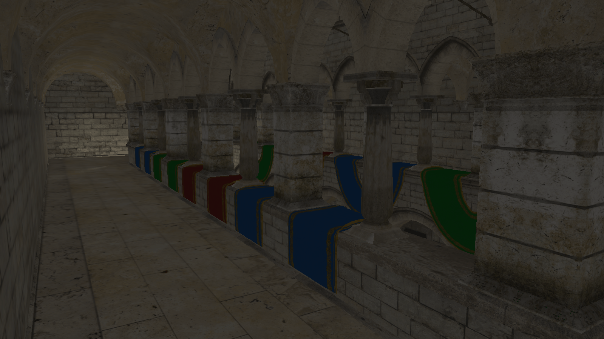
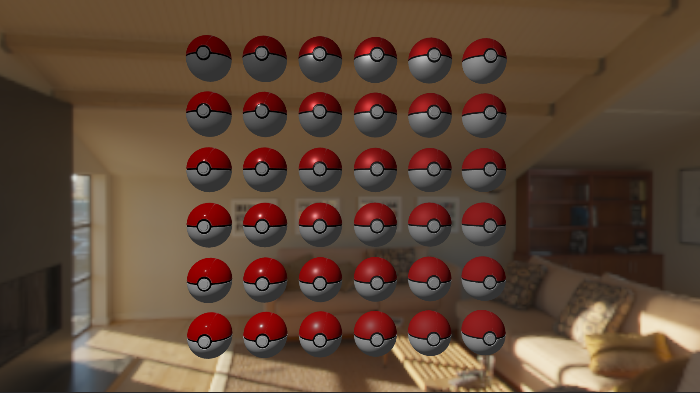
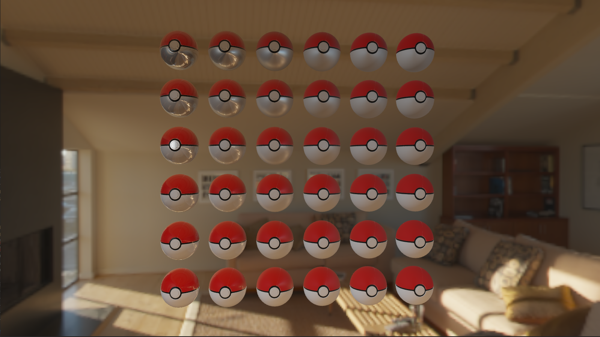

# LUMI

A real-time renderer based on OpenGL, which aims to achieve high-quality real-time rendering. 

## Framework

The Framework is based on [GAMES202 homework](https://www.bilibili.com/video/BV1YK4y1T7yY/) and [learnopengl](https://learnopengl.com/).

## Features

- ShadowMap/PCF/PCSS

- Deferred Shading
- Screen Space Ambient Occlusion
- PBR with IBL
- Gamma Correction & HDR & Bloom
- MSAA
- Skybox

## Results

**1. ShadowMap / PCF / PCSS**

**2. Deferred Shading & Bloom & HDR**

**3. SSAO**

**4. PBR (no IBL)**

**5. PBR (with IBL)**

